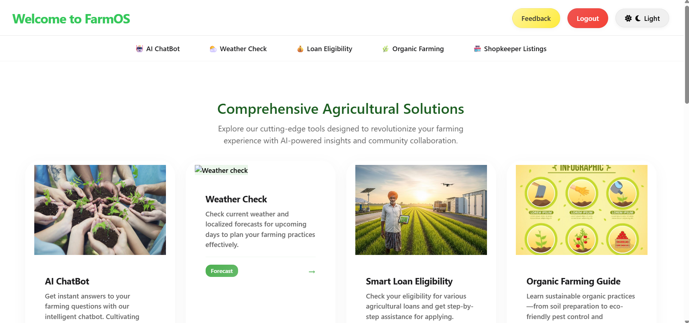
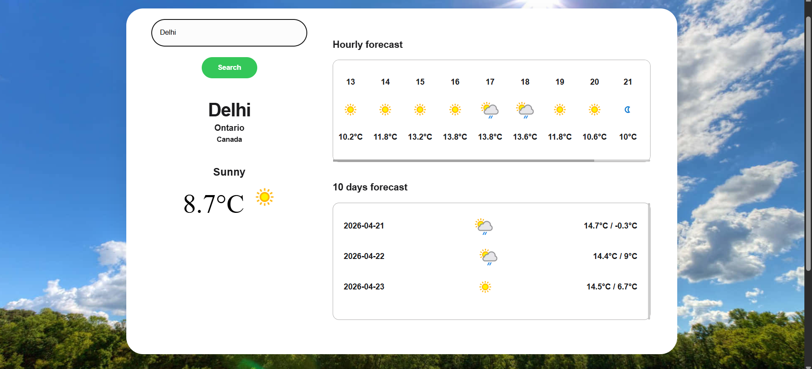
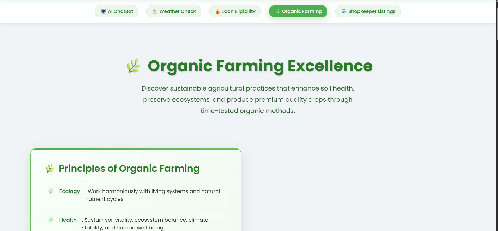

# FarmOS - Empowering Agricultural Excellence

**FarmOS** is a comprehensive, intelligent platform dedicated to transforming the agricultural landscape of India through the power of advanced technology. By bringing together AI-driven insights, precision data, and a localized ecosystem, FarmOS empowers every farmer to make confident, sustainable, and profitable decisions.

---

## Vision & Mission

Our mission is to bridge the urban-rural digital divide by providing even the smallest farm with the tools, data, and community support needed to thrive in a changing climate. We envision a future where technology is not a luxury, but a fundamental necessity for sustainable food security and economic resilience.

---

## Key Features

### Intuitive Dashboard
The central hub for navigating the FarmOS ecosystem, providing immediate access to our specialized tools and community insights.

  

### AI-Powered Assistant
A 24/7 intelligent companion powered by Google Gemini AI, providing expert answers to complex agricultural queries — from soil preparation to pest management.

  

### High-Precision Weather Intelligence
Stay informed with real-time, localized forecasts and upcoming 10-day outlooks to plan your farming operations with confidence.

  

### Smart Loan Eligibility Checker
Step-by-step guidance and automated assessment for agricultural loans, connecting farmers with major Indian financial institutions and government schemes.

### Organic Farming Excellence
Comprehensive guidance on sustainable practices, soil regeneration, and certification roadmaps for eco-friendly farming.

  

### Shopkeeper Ecosystem
Connect with trusted local vendors for quality agricultural inputs, ensuring transparent access to seeds, fertilizers, and modern equipment.

---

## Technology Stack

- **Core Intelligence**: [Google Gemini AI](https://aistudio.google.com/) for predictive insights and conversational assistance.
- **Backend Infrastructure**: Python and Flask for a responsive, scalable API service.
- **Frontend Architecture**: Modern HTML5, CSS3, and JavaScript with a premium, iOS-inspired aesthetic.
- **Data & Auth**: Firebase for robust user management and configuration.

---

## Connect with Us

**FarmOS Team**
- **Email**: support@FarmOS.com
- **Developer**: [Muskan Kakwani](https://github.com/muskankakwani06)

---

&copy; 2026 FarmOS | Empowering India's Farming Future
